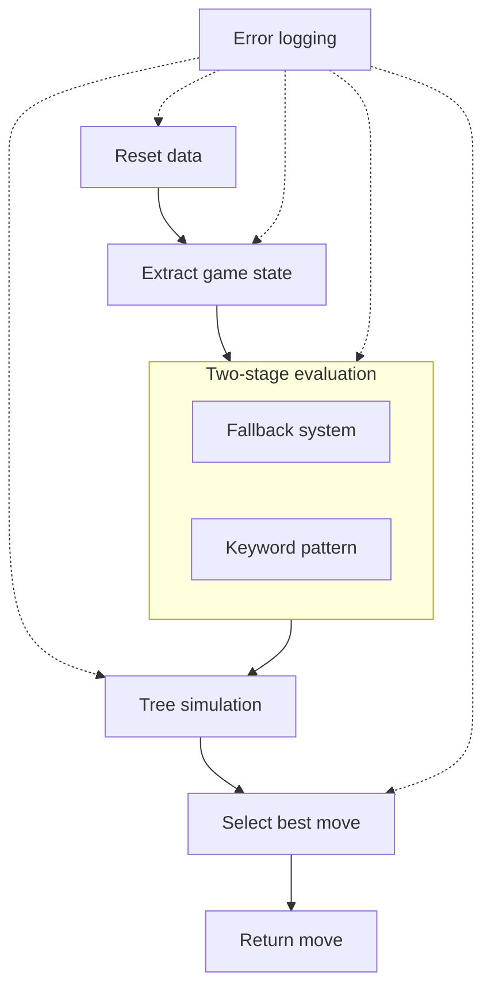

# Battlesnake Game Agent

A Python-based agent which processes Battlesnake game_states and figures out the best possible moves.

# Features
- two-stage evaluation — moves are filtered as safe/unsafe, then ranked by an integer priority score using calculation functions like calculate_opponents_positions, calculate_food, calculate_not_wall_collision, ...
- fallback system which wraps calculation functions - ensures a move is always returned even if calculation functions fail
- detailed error logging that captures level, turn and message asynchronously for performance — avoids blocking the main pipeline
- tree based future simulation which simulates the possibilities (only safe paths) of a selected move for a configurable number of turns in the future
- basic api infrastructure takes an server handler to handle post requests on fixed endpoints e.g. /info ; /start ; /move ; /end
- keyword pattern which validates keyword arguments for type and contents

# Usage

## Install dependencies using pip
Make sure you have Python 3.x installed.
```bash
pip install -r requirements.txt
```

## Run the battlesnake
```bash
python main.py
```

## Example
Open console and you should see:
```
 * Serving Flask app 'Battlesnake'
 * Debug mode: off
 * Running on all addresses (0.0.0.0)
 * Running on http://127.0.0.1:8000
 * Running on http://192.168.2.127:8000
Press CTRL+C to quit
```
Open http://localhost:8000 in your browser and you should see:
```
{"apiversion":"1","author":"","color":"#FF0000","head":"default","tail":"default"}
```

## Play a game locally
Install the battlesnake CLI
Choose one of the following installation methods:
- [Download compiled binaries](https://github.com/BattlesnakeOfficial/rules/releases)
- [Install as go package](https://github.com/BattlesnakeOfficial/rules/tree/main/cli#installation) (requires Go 1.18 or higher)

### Command to run a local game
```bash
battlesnake play -W 11 -H 11 --name 'Battlesnake Game Agent' --url http://localhost:8000 -g solo --browser
```

# How it works
The agent processes each game state through a fixed pipeline on every turn:


# Project structure
future
|
|--future_safety_tree.py #creates tree based on a move
|--future_safety.py #analyze safe paths of the tree
logger
|
|--emergency_logger.py #logs fallbacks asynchronously which are stored in a queue 
|--runtime_logger.py #setup logger + logger handlers in general
tests
|
|--tests_emergency_logger/
|--test_emergency_system/
|--test_future_safety/ #includes future_safety_tree.py
|--test_keywords/
|--test_move/ #also includes basic api tests
tools
|
|--log_analyzer/ #includes CLI Tool log_analyzer
emergency_system.py #fallback system, wraps calculation functions, guarantees a move is always returned
keywords.py #keyword pattern
main.py #starts server
move.py #agent´s interface, orchestrates all calculations and simulations, returns final move
server.py #ServerHandler which includes agent´s interface + setup server
validate_game_state.py #validates Battlesnake´s requests by checking received game state

# License
This project is licensed under the MIT License - see the [License](License) file for details.

# Log Analyzer
A CLI tool to analyze log files for critical errors and fallback events. 
See the [Log Analyzer README](tools/log_analyzer/README.md) for full documentation.