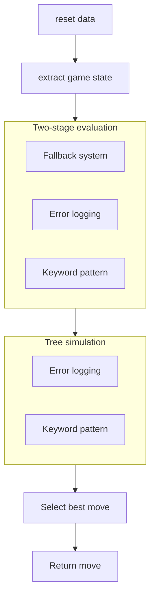

# Battlesnake Game Agent

A Python-based agent which processes Battlesnake game states and figures out the best possible moves.

# Features
- two-stage evaluation — moves are filtered as safe/unsafe, then ranked by an integer priority score using calculation functions like calculate_opponents_positions, calculate_food, calculate_not_wall_collision, ...
- fallback system which wraps calculation functions - ensures a move is always returned even if calculation functions fail
- detailed error logging that captures level, turn and message asynchronously for performance — avoids blocking the main pipeline
- tree-based future simulation which simulates the possibilities (only safe paths) of a selected move for a configurable number of turns in the future
- basic api infrastructure takes an server handler to handle post requests on fixed endpoints e.g. /info ; /start ; /move ; /end
- keyword pattern which validates keyword arguments for type and contents

# Usage

## Install dependencies using pip
Make sure you have Python 3.x installed.
```bash
pip install -r requirements.txt
```

## Run the battlesnake
```bash
python main.py
```

## Example
Open console and you should see:
```
 * Serving Flask app 'Battlesnake'
 * Debug mode: off
 * Running on all addresses (0.0.0.0)
 * Running on http://127.0.0.1:8000
 * Running on http://192.168.2.127:8000
Press CTRL+C to quit
```
Open http://localhost:8000 in your browser and you should see:
```
{"apiversion":"1","author":"","color":"#FF0000","head":"default","tail":"default"}
```

## Play a game locally
Install the battlesnake CLI
Choose one of the following installation methods:
- [Download compiled binaries](https://github.com/BattlesnakeOfficial/rules/releases)
- [Install as go package](https://github.com/BattlesnakeOfficial/rules/tree/main/cli#installation) (requires Go 1.18 or higher)

### Command to run a local game
```bash
battlesnake play -W 11 -H 11 --name 'Battlesnake Game Agent' --url http://localhost:8000 -g solo --browser
```

#### Example local game
See [Example local game](docs/local_game_screenshot.png)

# How it works
The agent processes each game state through a fixed pipeline on every turn:


# Project structure
```
battlesnake/
├── future/
│   ├── future_safety.py         # analyzes safe paths of the tree
│   └── future_safety_tree.py    # creates tree based on a move
├── logger/
│   ├── emergency_logger.py      # logs fallbacks asynchronously, stored in a queue
│   └── runtime_logger.py        # sets up logger and logger handlers
├── tests/
│   ├── test_api/                # basic api tests
│   ├── test_calculation/        # calculation method tests
│   ├── test_emergency_system/   # fallback system tests
│   ├── test_future/             # includes future_safety_tree.py 
│   ├── test_keywords/           # keyword pattern tests
│   ├── test_logger/             # logger tests
│   └── test_select_move/        # move selection tests
├── tools/
│   └── log_analyzer/            # CLI tool for log analysis
├── emergency_system.py          # fallback system, wraps calculation functions, guarantees a move is always returned
├── extract_data.py              # extracts and processes game state data — body, neck, length
├── keywords.py                  # keyword pattern
├── main.py                      # starts server
├── move.py                      # agent's interface, orchestrates all calculations and simulations, returns final move
├── server.py                    # Flask server, routes requests to move logic
├── server_handler.py            # handles incoming API requests, delegates to move agent and logger
└── validate_game_state.py       # validates Battlesnake's requests by checking received game state
```

# Log Analyzer
A CLI tool to analyze log files for critical errors and fallback events. 
See the [Log Analyzer README](tools/log_analyzer/README.md) for full documentation.

# License
This project is licensed under the MIT License - see the [LICENSE](LICENSE) file for details.