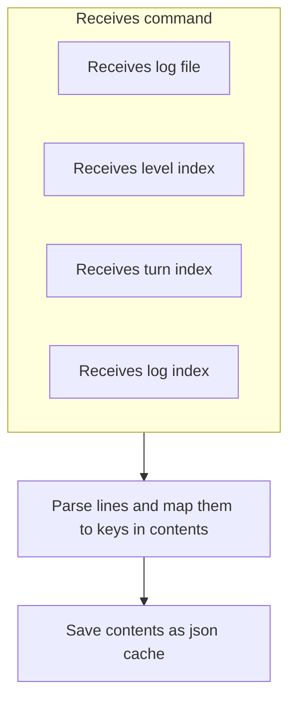
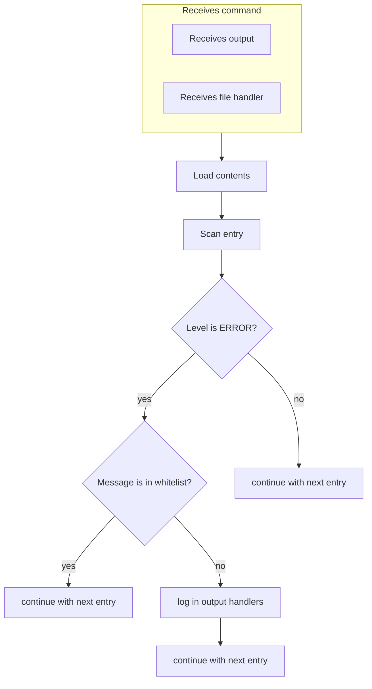

# Log Analyzer

A CLI tool that parses log entries, analyzes them for critical errors and fallback events. Designed to be used alongside the Battlesnake Game Agent to debug and monitor runtime behavior.

# Features
- log reader that iterates through lines and maps the contents of each line to keys like level, turn, message, ... — independent of log structure
- error analyzer that iterates through all contents and finds critical errors and fallback events with help of a whitelist
- caches parsed contents as JSON to allow multiple analysis operations without re-reading the log file
- multiple logging handlers like file handler, stream handler, ... - for flexible log output configuration

# Usage

## Install dependencies using pip
Make sure you have Python 3.x installed:
```bash
pip install -r requirements.txt
```
## Read the log file
Log entries are split by `|`. Provide indices to map each part to level, turn and message. Note: `--log_index` refers to message:
```bash
python -m tools.log_analyzer.main read_log --file file_path --level_index 0 --turn_index 1 --log_index 2
```

### Example
```bash
ERROR | TURN 0 | "Something went wrong"
```

## Analyze errors
Scans parsed log contents for critical errors and fallback events. Requires valid level and message in contents. Specify one or more output methods:
```bash
python -m tools.log_analyzer.main analyse_errors --output file console  --file_handler file_path
```

# How it works
The pipeline of read_logs.


The pipeline of analyse_errors. The pipeline runs for each log entry:
